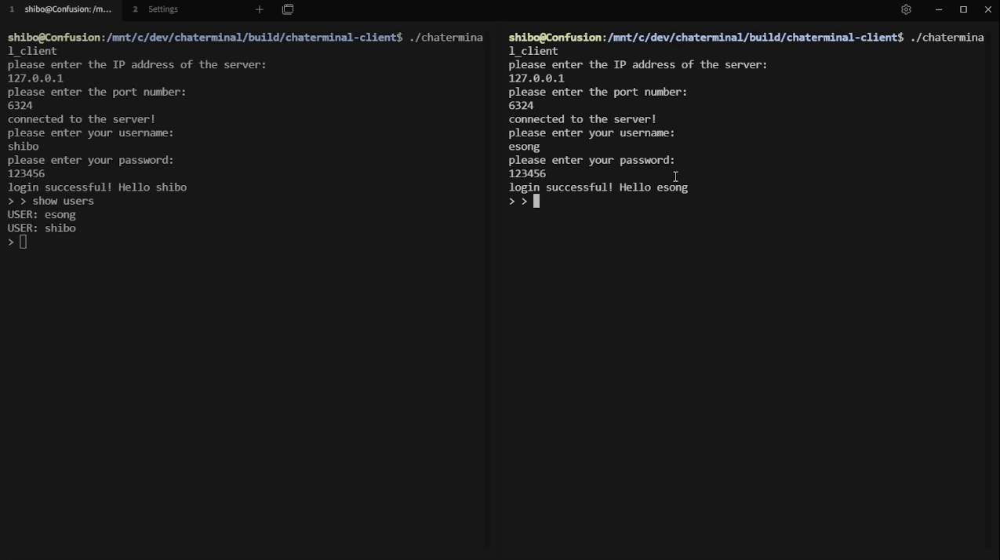

# Chaterminal

## Description

Chaterminal is a chat program that runs directly in your linux terminal! The project consists of two main components: `chaterminal-client` and `chaterminal-server`.



## Technical Details

The project is written in C and makes use of the following technologies:

- Linux system and socket programming
- MySQL database
- Libevent for event handling

## Dependencies

To compile and run chaterminal, you'll need the following dependencies:

- libmysqlclient
- libevent

## Compile

To compile the project, follow the steps below:

1. Run CMake to generate the build files:
    ```bash
    cmake -B ./build
    ```
2. Navigate to the build directory:
    ```bash
    cd build
    ```
3. Use `make` to compile the binaries:
    ```bash
    make
    ```
After successfully compiling, you'll find the server and client binaries in their corresponding folders.

## Server Setup

To set up the server, you need to have MySQL installed and properly configured with the required datasets and tables.

### Automated Setup

We provide a shell script called `db-setup.sh` that automates the database setup for you. This script is located in the `chaterminal-server` folder. The script will either install MySQL for you or add the necessary datasets and tables to your existing MySQL installation.

To use the automated setup, perform the following steps:

1. Navigate to the `chaterminal-server` folder:
    ```bash
    cd chaterminal-server
    ```

2. Make the script executable:
    ```bash
    chmod +x db-setup.sh
    ```

3. Run the script:
    ```bash
    ./db-setup.sh
    ```

This will take care of all the necessary database setup needed for running the server. After running this script, your MySQL database should be configured correctly for `chaterminal-server` to function properly.

## Server Configuration

Configuration settings for `chaterminal-server` are stored in a header file located at `chaterminal-server/include/settings.h`. The file contains various settings that you can customize to suit your environment.

Here's a brief explanation of each setting:

- `PORT`: The port number on which the server listens for incoming connections. Default is `6324`.
- `DB_USERNAME`: The username to connect to the MySQL database. Default is `"root"`.
- `DB_PASSWORD`: The password for the MySQL database user. Default is `"123456"`.
- `DB_SERVER_IP`: The IP address of the MySQL server. Default is `"127.0.0.1"`.
- `DB_NAME`: The name of the MySQL database to be used. Default is `"chaterminal"`.

### Example

The default `settings.h` file looks like this:

```c
#define PORT 6324
#define DB_USERNAME "root"
#define DB_PASSWORD "123456"
#define DB_SERVER_IP "127.0.0.1"
#define DB_NAME "chaterminal"
